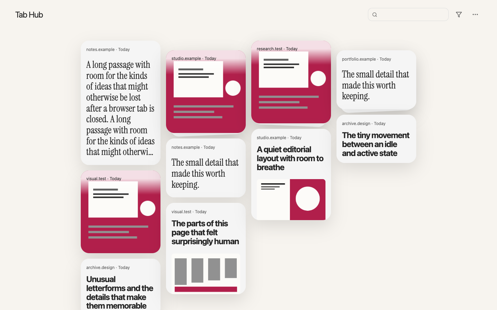

# Tab Hub

Tab Hub is a private, local-first Chromium extension for saving tab groups, pages and the particular passages or regions worth remembering. It verifies a group save before closing the original tabs.



## Try the round-two build

```bash
npm ci
npm run build
```

In a **throwaway Chromium profile**, open `chrome://extensions`, enable Developer mode and **Load unpacked** from `.output/round-2-chrome-mv3`. This branch is a review build; it has **not** been installed in the user's Chrome profile or merged into `main`. Its separate build directory keeps future branch builds away from the installed extension's default path.

The toolbar popup saves a group or tab, marks selected text or part of the visible page, and opens the hub. Its shortcut labels reflect Chrome's actual bindings. The hub shows one card per normalized page; the newest save is the face, while the side panel holds earlier page, passage and region saves. Search covers titles, sites, URLs, passages, and retained notes/guesses. Filters combine a browser group and a save type without changing stored groups.

Select a card for its thread. Open an individual save to return to its original page (native text fragment for passages, captured anchor for regions). Deleting a save or page hides it immediately; its **Deleted · Undo** toast and Cmd/Ctrl+Z restore it during the five-second undo window. Only after that window expires is it permanently removed from this profile. Existing pre-0.3 archived material remains in **Previously archived** until restored or explicitly deleted.

**More → Export/Import** manages complete, private `.tabhub` backups. An active undo window blocks backups so a pending deletion is not silently exported or restored. See [How it works](HOW_IT_WORKS.md) for details and [round-two handoff](process/round-2/SUMMARY.md) for evidence and limits.

## Develop and test

```bash
npm run dev
npm run typecheck
npm test
```

Playwright uses isolated disposable profiles; do not load this review branch into a personal profile. `npm run screenshots` refreshes the curated synthetic screenshot matrix. Recordings are generated by the optional `RECORD_ROUND2=1` design test; the committed `.mov` files in `process/round-2/recordings/` use only synthetic or local fixture pages.

The tracked [`claude-handoff/`](claude-handoff/) is a separate, privacy-safe planning bundle generated from the current canonical documents and selected synthetic screenshots. After substantial changes, run `npm run handoff:claude` and `npm run handoff:check`.
