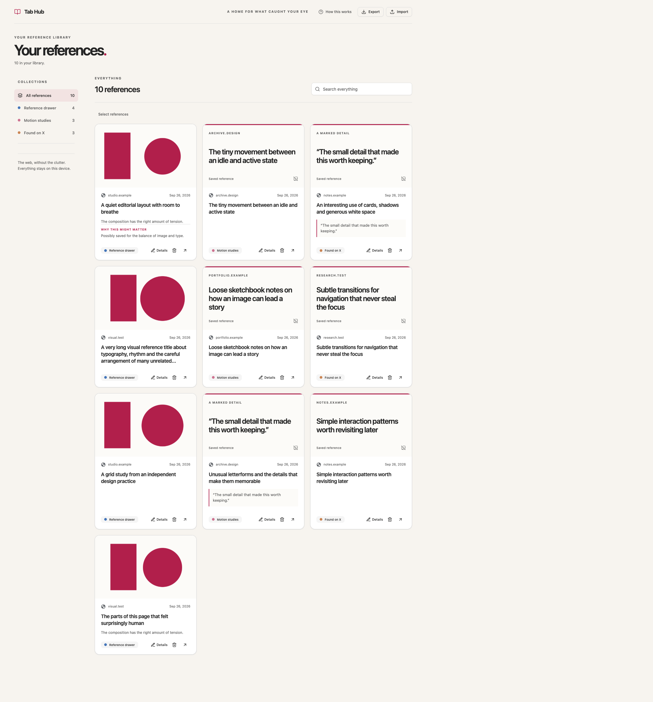

# Tab Hub

Tab Hub is a private, local-first Chromium extension for turning tab groups and individual tabs into a visual reference library. It is designed for links you want to remember rather than tasks you need to finish.



## What it does

- Saves an entire browser tab group or one tab in a deliberate action.
- Verifies every saved link before closing the original tabs.
- Preserves group names, colours and tab order.
- Shows visual cards with page previews, screenshots, marked passages or cropped regions.
- Searches titles, websites, URLs, notes and saved passage text.
- Keeps notes and optional Chrome on-device AI guesses editable.
- Permanently deletes one card, selected cards or a collection only after explicit confirmation. Older archived records remain available to restore or delete.
- Stores everything locally, with complete user-controlled export and import.

## Install locally

```bash
npm ci
npm run build
```

Then open `chrome://extensions`, enable **Developer mode**, select **Load unpacked**, and choose:

```text
.output/chrome-mv3
```

Pin Tab Hub in the browser toolbar for one-click access.

## Develop and test

```bash
npm run dev
npm run typecheck
npm test
# To deliberately refresh committed synthetic design screenshots:
npm run screenshots
```

WXT provides the Manifest V3 build and development reload flow. The automated suite uses persistent Playwright Chromium profiles to exercise the unpacked extension.

## Claude planning handoff

The tracked [`claude-handoff/`](claude-handoff/) folder is the small, uploadable planning bundle. It contains the product brief, current state, user guide, decisions, limits, a compact competitive summary and privacy-safe synthetic UI screenshots—including the deletion confirmation—without source code or private saved-tab data.

After every substantial completed task:

```bash
npm run handoff:claude
npm run handoff:check
```

Upload the contents of that folder to Claude and ask it to begin with `START_HERE.md`. `npm test` fails when the bundle is stale.

---

# How Tab Hub works

Tab Hub turns tab groups and individual tabs into a visual reference library. It helps you close tabs without losing the pages—or the exact details—that made them worth keeping.

> **Important:** Tab Hub does not automatically copy every open tab group. You choose which group or tab to save. This prevents it from unexpectedly collecting or closing anything.

## What you are looking at

### The header

- **How this works** opens the in-app guide.
- **Copy formatted text** copies the guide with headings, emphasis and lists intact.
- **Export** downloads a complete private backup of your references.
- **Import** restores a Tab Hub backup without overwriting conflicting local edits.

### Collections

The left side of the hub lists your saved browser groups. Each collection keeps the group's original name and colour.

- **All references** shows everything.
- Selecting a collection shows only that group's cards.
- **Individual tabs** holds pages that were saved outside a group.
- **Previously archived** appears only if you archived references in an earlier version. You can restore or permanently delete them; the upgrade does not remove them.

On a narrow window, collections become a horizontal row you can scroll.

### Reference cards

Each card represents one saved tab. A card can show:

- the page title, website and date saved
- the browser group it came from
- a marked passage or cropped visual region
- your own note
- an optional guess about why the page may have mattered

Click the card image—or **Details**—to see and edit everything attached to that reference. Use the arrow button to open the original page.

## Permanently delete a saved reference

Choose **Delete** on a card, or select several cards and choose **Delete selected permanently**. To remove a whole saved browser group, choose that collection and click **Delete collection**. **Select all matches** includes cards beyond the first screen.

Tab Hub asks for confirmation before deleting. This **cannot be undone inside Tab Hub**: its copy of each link, note, guess, marked piece and local image is permanently removed. A collection deletion also includes any of its cards that were previously archived. It does **not** delete the source website, your browser history or a `.tabhub` backup file you downloaded earlier.

### References archived in an earlier version

Older archived references are **not** automatically deleted on upgrade. Choose **Previously archived** to find them. You can **Restore** a card or collection, delete one, select several to delete, or delete a collection including its hidden cards. When all old archived references are gone, this section disappears.

If deletion fails partway through, Tab Hub keeps the confirmed deletion pending and provides **Retry deletion cleanup**. Do not import or export a backup until that cleanup finishes.

## Save a tab group

1. Go to any tab inside the browser tab group you want to save.
2. Click the Tab Hub extension in the browser toolbar.
3. Choose **Save "[group name]"**.
4. Tab Hub saves every tab, checks that every record can be read back, and opens the hub.
5. Only after that check succeeds does it close the original tabs.

If saving fails, or if a tab changes while saving, that tab stays open. Tab Hub itself is never treated as a reference.

If the active page is already Tab Hub, the popup only shows **Open your hub**. Switch to a tab inside the group before opening the popup.

## Save one tab

Open the extension while viewing the page and choose **Save this tab**. It becomes a card under **Individual tabs** and closes only after the save is verified.

You can also right-click a page and choose **Save this tab to Tab Hub**.

## Save the exact thing that matters

Saving a fragment does not close the page.

### Mark a passage

1. Select text on the page.
2. Right-click the selection.
3. Choose **Save selected passage to Tab Hub**.

You can also select text and choose **Mark selected text** in the extension popup.

The passage appears on the matching **visible** card and becomes searchable. If the page was never saved—or only a previously archived copy exists—Tab Hub creates a new individual card in the main library rather than hiding your new fragment.

### Mark a visual region

1. Open the extension and choose **Mark a visible region**, or right-click the page and choose the same action.
2. Drag a rectangle around the visible part you want to remember.
3. Release to save the crop.

The extension popup closes so you can drag directly on the page. Press **Esc** to cancel. Only the visible part of the current page can be cropped. Wait for a crop to finish before starting another; switching tabs during capture cancels it rather than saving the wrong page. If a capture fails, its error stays visible until you dismiss it; choose **Mark a visible region** again to retry. Some browser-protected pages do not allow the selector to open.

## Add notes and correct the guess

Open **Details** on any card.

- **Your note** is for your own words. It is optional and searchable.
- **Why you might have saved this** appears only when Chrome's on-device model is available. It is a tentative guess, not a fact.
- You can edit the guess. Once you do, Tab Hub will not replace your wording with another automatic guess.

Unsaved edits must be saved or explicitly discarded before the details window closes.

## Find something again

Use **Search everything** above the cards. Search looks through:

- page titles
- website names and URLs
- your notes
- saved passage text

Search works across the current view: all visible references, one selected collection, or **Previously archived** if that legacy section exists.

## How card visuals are chosen

Tab Hub tries these in order:

1. your newest marked visual region or passage crop
2. a screenshot of the active tab, when Chrome permits one
3. the page's own preview image, copied into local storage
4. a designed text cover when no image is available

A missing or broken image never prevents the link from being saved.

## Keep a backup

Everything lives in this browser profile, so use **Export** occasionally.

The downloaded `.tabhub` file includes current links, groups, notes, guesses, marked passages, stored images and any remaining legacy archive state. Keep it somewhere private: it contains part of your browsing history and is not encrypted.

Use **Import** to restore it. Tab Hub verifies identical existing records and refuses to overwrite a conflicting local edit. Backups made before archive existed still import normally. A backup saved before you permanently deleted a card still contains that earlier copy; importing it is an explicit way to recover it.

## Privacy and limits

- There is no account, server or cross-device sync.
- Nothing is deleted automatically or after a timer; only your confirmed **Delete permanently** action removes local data.
- Page data is not sent to a hosted AI service.
- The copy button writes this guide only when you click it; Tab Hub does not read your clipboard.
- The optional guess uses Chrome's built-in on-device model only when it is already available.
- Removing the extension or deleting its browser profile can remove its local data, so keep an exported backup.
- Chrome's own internal pages can be saved as links, but they may not allow screenshots or fragment capture.
- Local `file://` pages may require **Allow access to file URLs** in the extension's Chrome settings.

For the source used by the in-app dialog, see [`HOW_IT_WORKS.md`](HOW_IT_WORKS.md).
